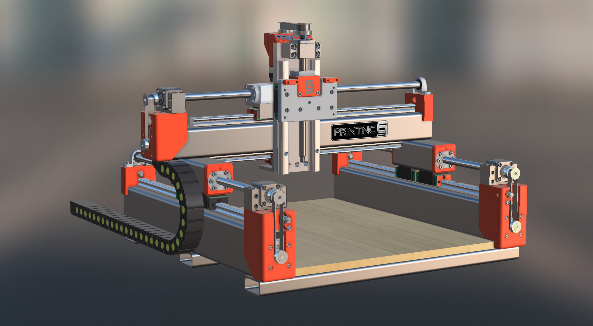

# printNC Mini (WIP) Please get up to date through Discord.

The PrintNC Mini is a version of the PrintNC(https://wiki.printnc.info/en/home), made for smaller footprint.

Like the PrintNC, the mini is a high-performance, DIY CNC router, with steel construction and 3d printed parts.
The Mini does not have the same support and information available and is currently in the stage of getting a reliable, usable, thoroughly tested CAD model.
This repo is the home of said CAD model, with the latest fixes and changes approved by the community.

Is there something you’re looking for that is not here yet? Join [Discord](https://discord.gg/RxzPna6) and ask there. Answers are fast and the community is quickly growing!

## License

The PrintNC Mini is completely open-source and operates under the CC BY 4.0 license. See the [LICENSE](LICENSE.md) file for more information.
